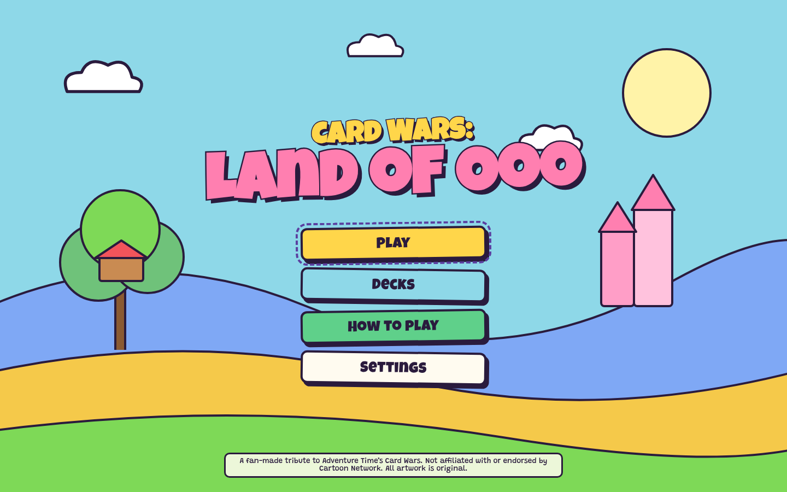
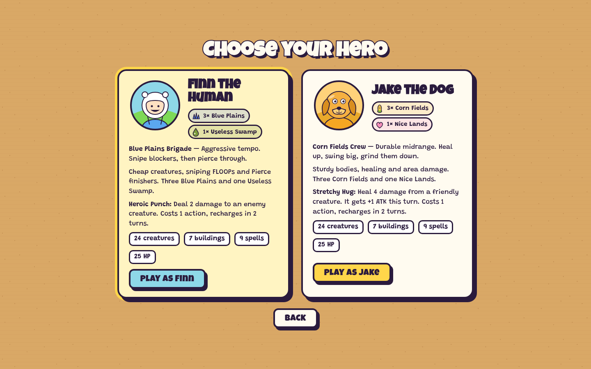
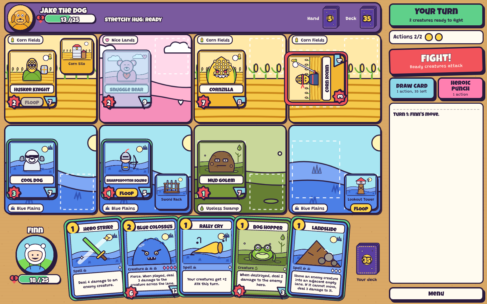
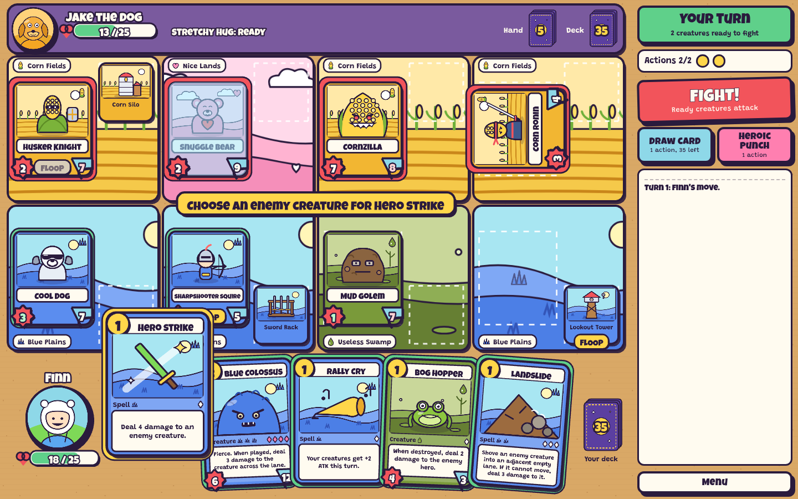
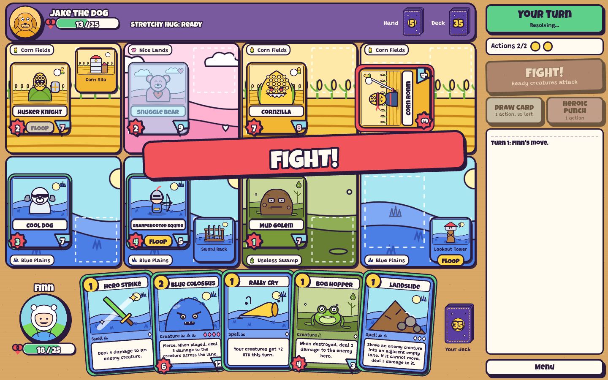
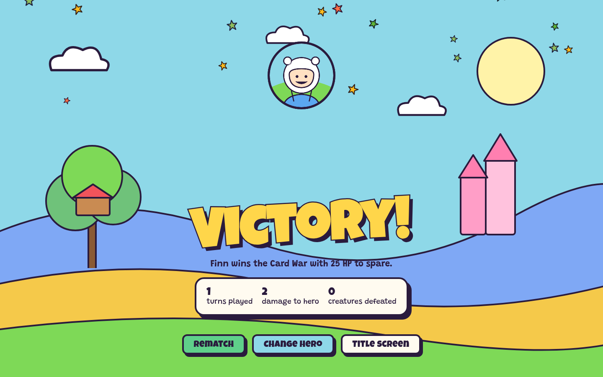

# Card Wars: Land of Ooo

A browser card battler inspired by the "Card Wars" game from *Adventure Time*. You pick Finn or Jake, lay four landscapes, fill four lanes with creatures and buildings, FLOOP abilities, and fight a heuristic AI until one hero hits 0 HP.

> **Fan project.** Not affiliated with or endorsed by Cartoon Network or the makers of the original Card Wars games. No assets were ripped, scraped or downloaded from any Card Wars app. Every image is original vector art generated by `tools/generate-art.mjs`, and every sound is synthesised at runtime. The asset layer is data-driven, so licensed or commissioned art can be swapped in later without code changes.

| | |
| --- | --- |
|  |  |
|  |  |
|  |  |

## Stack

| Piece | Choice |
| --- | --- |
| Rendering and game loop | [Phaser 3.90](https://phaser.io) (WebGL, Canvas fallback) |
| Language | TypeScript (strict) |
| Build and dev server | Vite |
| Menus and HUD controls | Plain DOM and CSS overlays (no framework) |
| Unit tests | Vitest |
| Browser tests | Playwright |
| Fonts | Luckiest Guy and Grandstander, bundled via `@fontsource` (no network fonts) |

## Getting started

```bash
npm install
npm run dev        # http://127.0.0.1:5173
```

| Command | What it does |
| --- | --- |
| `npm run dev` | Vite dev server with hot reload |
| `npm run build` | Type-check, then build a static site into `dist/` |
| `npm run preview` | Serve the production build locally |
| `npm run typecheck` | `tsc --noEmit` |
| `npm test` | Rules, AI and card-data unit tests (Vitest) |
| `npm run test:e2e` | Playwright browser tests (starts its own dev server) |
| `npm run sim` | Opt-in balance report: 80 AI-vs-AI games with seats swapped |
| `npm run art` | Regenerate every SVG in `public/assets` from `tools/art/*` |

`dist/` is fully static, so any static host works. Asset paths are relative (`base: './'`), which means it also runs from a sub-folder.

## How the game plays

Each player has **25 HP**, four landscapes (one per lane), a 40-card deck and a 5-card opening hand. Every turn you:

1. Ready your cards: FLOOPed cards straighten up and drowsy creatures wake. Then you draw a card.
2. Spend **2 Action Points** on creatures, buildings, spells, your hero power, or drawing an extra card. The first player gets only 1 AP on turn 1 and skips that first draw.
3. FLOOP any number of ready creatures or buildings, as long as you can pay their cost.
4. Press **FIGHT!** Every ready creature attacks straight down its lane. It hits the creature across from it, or the enemy hero if that lane is empty.

The full rules, including the deliberate simplifications of the tabletop game, are in [docs/gameplay-rules.md](docs/gameplay-rules.md).

## Architecture at a glance

```
src/
  main.ts                 boot: fonts, Phaser game, resize handling
  settings.ts             persisted player settings + URL flags
  assets/manifest.ts      every asset key → file (swap art here)
  audio/AudioManager.ts   event-based sound; synth placeholders, sample hooks
  game/                   pure TypeScript rules, no Phaser imports
    cards/                card type model + validation
    data/                 card definitions, decks, heroes, landscapes
    state/                GameState types, creation, queries
    rules/                engine (applyAction), legality, turns, stats, zones
    effects/              reusable effect system (damage, heal, buff, summon…)
    combat/               lane combat + "why can't this fight" status
    ai/                   legal-action enumeration, evaluation, controller
    events/               event types the renderer animates
  scenes/                 Boot, MainMenu, DeckSelect, Battle, Result, HowToPlay
  ui/                     card views, board, hand, rail, animator, interaction
  debug/                  ?debug=true panel and test hooks
tools/                    procedural SVG art pipeline
tests/unit, tests/e2e     Vitest and Playwright suites
```

The engine is a pure function: `applyAction(state, action) → { state, events }`. State is plain serialisable data with a seeded RNG, so the same seed and actions always replay the same game. That makes AI simulation, tests and future networked play straightforward. See [docs/architecture.md](docs/architecture.md).

## Cards

Cards are data (`src/game/data/cards/*.ts`), never UI code. A card lists its stats plus **effects** built from a small vocabulary (`DAMAGE`, `HEAL`, `BUFF`, `DRAW`, `SUMMON`, `FREEZE`, `PUSH`, `MOVE_ADJACENT`, `DESTROY_BUILDING`). Each effect is aimed with **selectors** such as `TARGET`, `OPPOSING_CREATURE` or `ADJACENT_FRIENDLIES`, and hung on **triggers** (`onPlay`, `onDeath`, `onTurnStart`) or a **FLOOP** ability.

### Adding a new card

1. Add it to a faction file in `src/game/data/cards/` with the `creature()`, `building()` or `spell()` helper.
2. Add copies to a deck in `src/game/data/decks.ts`, keeping each deck at exactly 40.
3. Add art: a subject function in `tools/art/*.mjs` and its backdrop faction in `tools/generate-art.mjs`. Then run `npm run art`, or point the manifest at your own image.
4. Run `npm test`. The validator catches bad costs, missing targets, unplayable factions and wrong deck sizes.
5. Optionally run `npm run sim` to check the matchup is still roughly even.

Walkthroughs with examples: [docs/card-authoring.md](docs/card-authoring.md).

### Adding a new spell effect

Add a variant to the `Effect` union in `src/game/cards/types.ts`, then handle it in `applyEffect` in `src/game/effects/resolve.ts`. TypeScript's exhaustive switch shows you every other place that needs to know about it. If the effect restricts valid targets, filter them in `validTargets` (`src/game/rules/legality.ts`).

### Adding a new faction

1. Add it to `LandFaction` and `FACTION_NAMES` in `src/game/cards/types.ts`.
2. Add a landscape in `src/game/data/cards/shared.ts`. It can have a `laneAura` or `onTurnStart` trigger.
3. Give it a colour in `src/ui/theme.ts` (`FACTION_COLORS`).
4. Give it a glyph shape in `tools/art/scenes.mjs`. The glyph must be a distinct shape, not just a new colour, so factions stay readable without colour. Then add its backdrop in `tools/art/common.mjs` and `landscapeTile`.
5. Register the glyph in `src/assets/manifest.ts` and run `npm run art`.

## AI

The AI is a one-ply greedy planner over the real engine (`src/game/ai/`):

1. `enumerateActions` lists every legal concrete action: card × lane or target, each FLOOP × target, the hero power, and drawing.
2. Each candidate is applied to a cloned state, then the rest of the turn is played as "fight now". Candidates are judged on where they leave the board **after combat**.
3. `evaluate` scores that position in named terms: `lethalPotential`, `immediateDamage`, `defenseValue`, `boardControl`, `removalValue`, `synergy` and `resources`.
4. The AI takes the best action if it beats simply ending the turn, and repeats until nothing helps. It is capped at 24 actions per turn.

It never sees your hand, only card counts. Because it simulates through the same engine the player uses, it can never make an illegal move. Details are in [docs/architecture.md](docs/architecture.md#ai).

## Debugging

Open `/?debug=true`. The panel shows:

- the full game state: seed, RNG cursor, turn, player, AP, card ids (`defId#uid`) and lane ids 0–3
- the AI's last decision with its score breakdown

It also has buttons to add any card to your hand, restore or set HP, add AP, skip a turn, force an AI action, and reset the battle.

Other URL flags:

| Flag | Effect |
| --- | --- |
| `seed=123` | Deterministic shuffle and coin flip |
| `speed=4` | Speeds up all animations (used by tests) |
| `test=true` | Exposes `window.__cardwars` for automation |
| `renderer=canvas` | Forces the Canvas renderer |

## Testing

- `npm test` runs 34 unit tests covering card validation, action points, landscapes, damage calculation, combat resolution, the win condition, FLOOP restrictions, and AI legality, lethal and removal. It includes full AI-vs-AI games checked against state invariants every turn.
- `npm run test:e2e` runs Playwright against the real canvas: menus, deck browser, tutorial, playing cards, wrong-landscape feedback, spells, FLOOP, fight, the AI's turn, victory, defeat, rematch, reload, keyboard play, the debug panel, and four viewport sizes.

More in [docs/testing.md](docs/testing.md).

## Accessibility

- Turn controls are real DOM buttons with labels and visible focus.
- The battle log is mirrored to an `aria-live` region.
- Canvas objects are reachable from the keyboard: arrows move focus, Enter/Space activates, 1–8 pick a hand card, and F, D and H are FIGHT, Draw and Hero power. Esc cancels or opens the menu.
- Factions are identified by glyph shape and name, not colour alone. ATK is a burst and DEF a shield.
- Reduced motion follows the OS setting and can be toggled in Settings.
- Every refused action says why, for example "Not enough Action Points", "Wrong Landscape" or "Already FLOOPed this turn".
